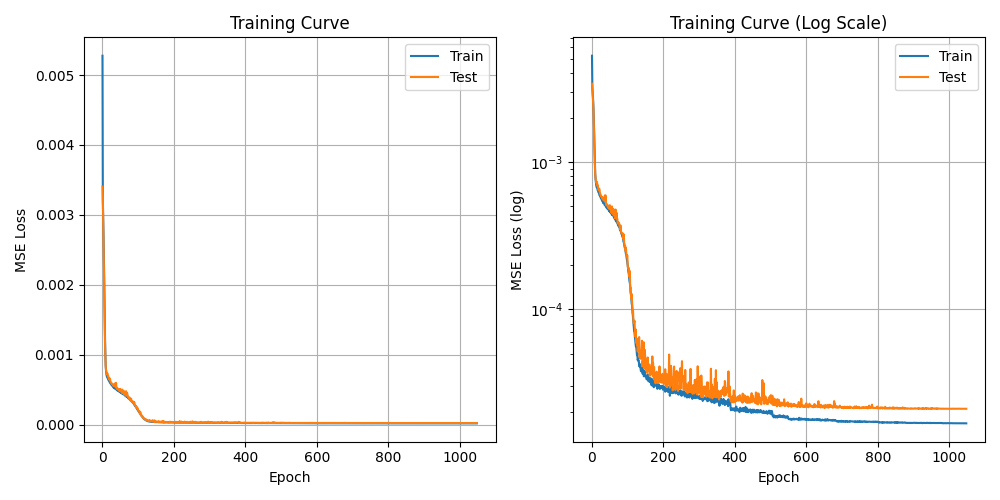
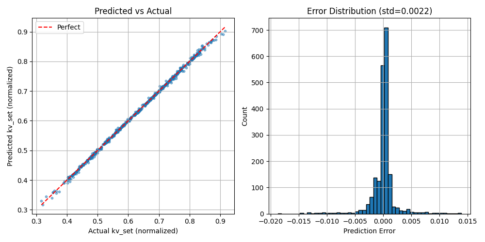
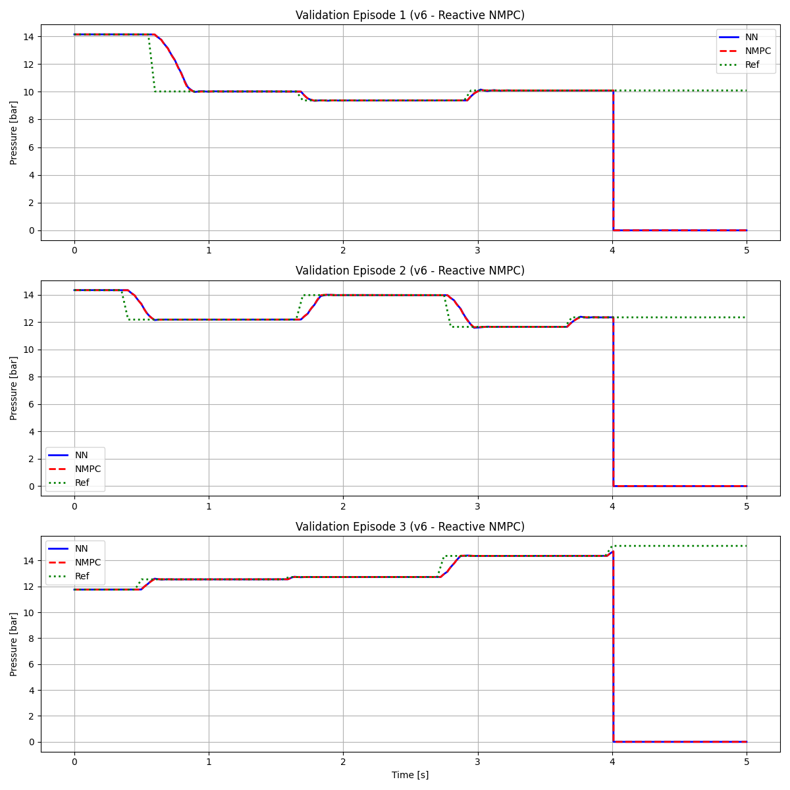
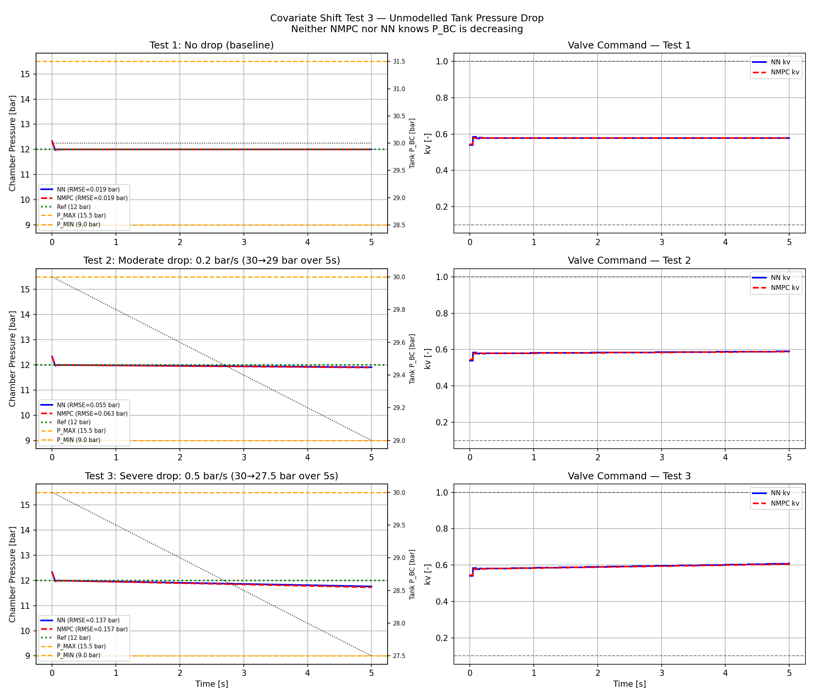

# Imitation Learning for Optimal Thrust Control of Rocket Engines

Behaviour cloning (BC) is used to train a compact neural network (NN) that imitates a Nonlinear Model Predictive Controller (NMPC) for a monopropellant rocket engine. The NN achieves comparable closed-loop pressure tracking performance to the NMPC expert at a fraction of the computational cost — enabling real-time deployment on embedded hardware.

---

## Motivation

NMPC provides effective pressure regulation but invokes an iterative nonlinear solver (CasADi/IPOPT) at every 50ms control step, requiring 54–456ms per call on a standard desktop CPU (AMD Ryzen 5 5500U). This leaves no margin for embedded deployment. A NN can replicate the same control policy in under 1ms via a single forward pass.

---

## System Overview

### Physical System
```
Tank (30 bar) → Pipe → Valve (kv) → Chamber → Nozzle
   p_bc          ṁ_p, p_p            p_c       exhaust
```

### Two Models

| Model | States | Purpose |
|-------|--------|---------|
| **Monoprop_sim** (full-order) | $[\dot{m}_p, p_p, k_v, p_c]^\top$ | Ground truth simulation for data collection |
| **Monoprop** (reduced-order) | $[p_c]^\top$ | NMPC prediction model (quasi-steady pipe dynamics) |

The full-order model is used as the closed-loop simulation environment during data collection. The NMPC uses the reduced-order model internally for prediction.

### Key Parameters

| Parameter | Value |
|-----------|-------|
| Sampling time | 50ms |
| Prediction horizon | 1.0s (20 steps) |
| Valve bounds | $k_v \in [0.1, 1.0]$ |
| Rate limit | $\|\dot{k}_v\| \leq 1.43\,\text{m}^3/\text{h/s}$ |
| Operating range | 9.0 – 15.5 bar |
| Fluid | Ethanol (C₂H₆O) |
| Tank pressure | 30 bar |

---

## Neural Network Policy

**Mapping:** $f(p_c,\, p_{c,\text{ref}},\, k_{v,\text{prev}}) \rightarrow k_{v,\text{set}}$

- `p_c` — current chamber pressure (normalised)
- `p_c_ref` — reference chamber pressure (normalised)
- `kv_prev` — previous valve command (raw, included because NMPC is a set-point tracker)
- `kv_set` — valve command output, bounded to [0.1, 1.0]

**Architecture:** 3 → 5 → 5 → 1 (56 parameters)
- Two hidden layers with Tanh activations
- Sigmoid output layer bounding $\hat{k}_v \in [0.1, 1.0]$
- Architecture chosen empirically — larger configurations showed no improvement on this near-linear mapping

**Loss Function:** Weighted MSE — active steps ($|\Delta k_v| \geq 0.02$) weighted 5× over idle steps

**Training:**
- Adam optimiser, lr = $10^{-3}$
- ReduceLROnPlateau scheduler (halve LR after 30 epochs without improvement)
- Early stopping (patience = 100 epochs, restores best weights)
- Episode-level 80/20 train/test split (prevents data leakage)

---

## Results

### Training

*Train and test losses track closely — no overfitting. Converges in ~300–500 epochs.*

### Open-Loop Prediction Accuracy

*Predicted vs actual $k_v$ on held-out test set. Error std = 0.0022, MSE = $4.0 \times 10^{-6}$.*

### Closed-Loop Validation vs NMPC

*NN (blue) vs reactive NMPC (red dashed) vs reference (green dotted) across 3 random episodes. Step response times and steady-state errors are comparable.*

### Out-of-Distribution Robustness

*OOD testing: initial valve positions outside training range and reference steps outside [9.0, 15.5] bar. Moderately OOD conditions self-correct via $p_c$ feedback; strongly OOD inputs cause tanh saturation.*

### Computational Performance

| Controller | Mean (ms) | Std (ms) | Min (ms) | Max (ms) |
|------------|-----------|----------|----------|----------|
| NN | 0.32 | 0.07 | 0.27 | 0.98 |
| NMPC | 60.6 | 23.8 | 53.9 | 456.4 |

*Measured on AMD Ryzen 5 5500U. ~190× speedup.*

---

## Setup

### 1. Clone the Repository
```bash
git clone <repo-url>
cd BC_NMPC
```

### 2. Create Virtual Environment
```bash
python3 -m venv rocket
source rocket/bin/activate
```

### 3. Install Dependencies
```bash
pip install numpy scipy matplotlib torch casadi CoolProp ipykernel
```

### 4. Register Jupyter Kernel (for notebooks)
```bash
python3 -m ipykernel install --user --name=rocket --display-name="Python (rocket)"
```

---

## Quick Start

### Step 1 — Collect Training Data
```bash
cd scripts && python3 collect_data.py
```
Generates 125 episodes × 80 steps = 10,000 state-action samples using parallel NMPC rollouts (8 workers, ~5–10 minutes).
Output: `data/bc_dataset_v6.npz`

### Step 2 — Train Neural Network
```bash
python3 train_nn.py
```
Outputs:
- `results/models/policy_model.pth` — weights + normalisation stats
- `results/plots/training_curve_*.png`
- `results/plots/prediction_results_*.png`

### Step 3 — Validate Against NMPC
```bash
python3 validate_nn.py
```
Compares NN vs reactive NMPC on 3 random 5s episodes. Prints timing statistics.
Output: `results/plots/validation_v6.png`

### Step 4 — OOD / Covariate Shift Tests
```bash
python3 covariate_shift_3.py   # OOD references + disturbances
python3 covariate_shift_2.py   # Measurement noise
```

### Step 5 — Explore Dataset (Jupyter)
```bash
jupyter notebook notebooks/
```
- `explore_dataset.ipynb` — dataset distributions and episode quality
- `kv_pc_mapping.ipynb` — steady-state $k_v$–$p_c$ mapping linearity

---

## File Structure

```
BC_NMPC/
├── src/                        # Physics models and NMPC solver
│   ├── model.py                # Monoprop_sim (4-state) & Monoprop (1-state)
│   ├── mpc.py                  # NMPC solver (CasADi/IPOPT)
│   ├── integrator.py           # RK4 numerical integration
│   ├── reference.py            # Reference trajectory generation
│   └── plotting.py             # Visualization utilities
│
├── scripts/                    # Behaviour cloning pipeline
│   ├── collect_data.py         # Parallel data collection (ZOH references, v6)
│   ├── train_nn.py             # Train policy network
│   ├── validate_nn.py          # Compare NN vs NMPC with timing stats
│   ├── covariate_shift_2.py    # Measurement noise robustness test
│   ├── covariate_shift_3.py    # Tank pressure drop + OOD test
│   └── main.py                 # Original NMPC demo
│
├── notebooks/
│   ├── explore_dataset.ipynb   # Dataset statistics and distributions
│   └── kv_pc_mapping.ipynb     # kv–pc steady-state mapping analysis
│
├── report/                     # Forschungspraxis paper (LaTeX)
│   ├── FP_paper.tex
│   └── chapters/
│
├── data/                       # Generated datasets (not tracked in git)
│   └── bc_dataset_v6.npz
│
└── results/                    # Generated outputs (not tracked in git)
    ├── models/
    │   └── policy_model.pth
    └── plots/
```

---

## Dataset (v6)

- **10,000 samples** across 125 episodes (80 steps each, 5s at 50ms)
- ZOH step references within [9.0, 15.5] bar operating range
- Reactive NMPC expert (current reference only — no future lookahead)
- Parallel collection using `multiprocessing.Pool` with 8 workers
- Episode-level train/test split to prevent data leakage

---

## Dependencies

```
numpy, scipy, matplotlib
torch        # Neural network training
casadi       # NMPC optimisation (CasADi/IPOPT)
CoolProp     # Fluid thermodynamic properties
ipykernel    # Jupyter notebook support
```

---

## Report

The full methodology, results, and discussion are documented in the Forschungspraxis paper:
`report/FP_paper.pdf` — *Imitation Learning for Optimal Thrust Control of Rocket Engines*, Amir Suhail Salim, TUM 2026.
